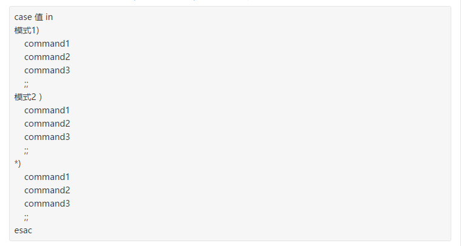

# shell脚本学习

- echo -e 不显示转义的字符

- shell传递参数实例
```jshelllanguage
#!/bin/bash
# author:菜鸟教程
# url:www.runoob.com

echo "Shell 传递参数实例！";
echo "执行的文件名：$0";
echo "第一个参数为：$1";
echo "第二个参数为：$2";
echo "第三个参数为：$3";

$ chmod +x test.sh 
$ ./test.sh 1 2 3
Shell 传递参数实例！
执行的文件名：./test.sh
第一个参数为：1
第二个参数为：2
第三个参数为：3
```

- $* 与 $@ 区别：
 相同点：都是引用所有参数。
 不同点：只有在双引号中体现出来。假设在脚本运行时写了三个参数 1、2、3，，则 " * " 等价于 "1 2 3"（传递了一个参数），而 "@" 等价于 "1" "2" "3"（传递了三个参数）。

- 运算符
eq：equal to。
ne：not equal to。
gt：greater than。
ge：greater than or equal to。
lt：less than。
le：less than or equal to。

- shell脚本还是有点意思，可以方便地传变量

- shell里如果是赋值那么算式那么等号两边不能有空格
而如果是进行比较等算式，则必须要有空格在两边

- shell语句中的case when 用法


- shell脚本求解一元二次方程
不熟悉的东西，坑也是众多
```jshelllanguage
#!/bin/bash
while read nums
do
   array=($nums)
        a=${array[0]};b=${array[1]};c=${array[2]}
# echo $a;echo $b;echo $c;
tmp=$(scale=2;echo "sqrt($b*$b-4*$a*$c)"|bc);
#echo $tmp;
#echo "scale=2;$b+$tmp"|bc
x1=$(echo "scale=2;(-($b)+$tmp)/(2*$a)"|bc)
x2=$(echo "scale=2;(-($b)-$tmp)/(2*$a)"|bc)
echo "x1=$x1"
echo "x2=$x2"
done
```

