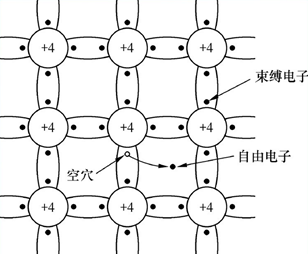
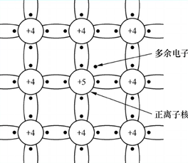

- 热泪盈眶，大学学的东西，终于能起到点桥梁作用了
- 虽然与编程没有直接的联系，但是却是二进制、寄存器、计算机内存等等的基本原理，源头所在。从源头弄懂，才可以构建一个完整的知识体系，浑身才会舒坦，进而更好地编程。
# PN结
- 本征半导体

> 2019.2.2 更新于k210，别有一番风味

如图为本征半导体的结构，其含义为没有掺杂任何杂质的硅或锗的结构，在热运动下，部分电子会脱离束缚，这样就形成了空穴-电子对，电子是有电荷的，而空穴则具有吸引电子的能力，所以这两者都是属于载流子。

- N型材料

在本征半导体中掺入磷杂质，那么该种物质的成键方式如图，由于磷的外层具有5个电子，所以则打破了原有的空穴和电子对的平衡，此时电子数远大于空穴数，（注意：宏观上来说，对外界，它仍然是属于电中性的），由于其结构体中，电子很多，故称该种掺磷的本征半导体为N（Negative）材料。（导电的本质是载流子的运动，形成电流而已，当一种物质具有很多载流子时，则其导电能力就增强）。

- P型材料

和掺磷的相对应，由于硼的外层电子数为3，所以形成共价键时，空穴更多，空穴是吸引电子，所以该种物质属于P(Positive)材料

- 将P型材料和N型材料相连构成PN结

将两者相连之后，由于空穴和电子的相互吸引，则PN结则会相互发生扩散运动，此时注意了，由于这两种材料，连接之前其实都还是呈现电中性的，所以，P型材料失去空穴（吸引了电子），带负电。N型半导体失去了电子，则带正电。因此则形成了内电场，该内电场是阻碍扩散运动的，会使空穴和电子与扩散运动相反的方向运动，称为漂移运动。那么，这样会最终形成一个稳定状态，即局部区域内，扩散运动和漂移运动相平衡，这个区域被称为耗尽层，由于该内部空穴和电子相平衡，所以相当于其载流子很少，即阻碍导电。

那么将PN结两端用导线连接起来，并加以电源，此时电压方向有两种，如图显示的为P点电势更高，此时外电场与内电场方向相反，会削弱内电场，即导电性能会增强。反之则导电性能变差（在高压下，耗尽层非常宽，电阻很大，可视为无法导电）。这样，PN结实际上就实现了一种单向导电的功能。

