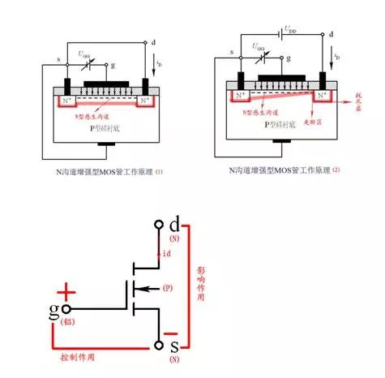

- 热泪盈眶，大学学的东西，终于能起到点桥梁作用了
- 虽然与编程没有直接的联系，但是却是二进制、寄存器、计算机内存等等的基本原理，源头所在。从源头弄懂，才可以构建一个完整的知识体系，浑身才会舒坦，进而更好地编程。
# PN结
- 本征半导体

> 2019.2.2 更新于k210，别有一番风味

如图为本征半导体的结构，其含义为没有掺杂任何杂质的硅或锗的结构，在热运动下，部分电子会脱离束缚，这样就形成了空穴-电子对，电子是有电荷的，而空穴则具有吸引电子的能力，所以这两者都是属于载流子。

- N型材料

在本征半导体中掺入磷杂质，那么该种物质的成键方式如图，由于磷的外层具有5个电子，所以则打破了原有的空穴和电子对的平衡，此时电子数远大于空穴数，（注意：宏观上来说，对外界，它仍然是属于电中性的），由于其结构体中，电子很多，故称该种掺磷的本征半导体为N（Negative）材料。（导电的本质是载流子的运动，形成电流而已，当一种物质具有很多载流子时，则其导电能力就增强）。

- P型材料

和掺磷的相对应，由于硼的外层电子数为3，所以形成共价键时，空穴更多，空穴是吸引电子，所以该种物质属于P(Positive)材料

- 将P型材料和N型材料相连构成PN结

将两者相连之后，由于空穴和电子的相互吸引，则PN结则会相互发生扩散运动，此时注意了，由于这两种材料，连接之前其实都还是呈现电中性的，所以，P型材料失去空穴（吸引了电子），带负电。N型半导体失去了电子，则带正电。因此则形成了内电场，该内电场是阻碍扩散运动的，会使空穴和电子与扩散运动相反的方向运动，称为漂移运动。那么，这样会最终形成一个稳定状态，即局部区域内，扩散运动和漂移运动相平衡，这个区域被称为耗尽层，由于该内部空穴和电子相平衡，所以相当于其载流子很少，即阻碍导电。

那么将PN结两端用导线连接起来，并加以电源，此时电压方向有两种，如图显示的为P点电势更高，此时外电场与内电场方向相反，会削弱内电场，即导电性能会增强。反之则导电性能变差（在高压下，耗尽层非常宽，电阻很大，可视为无法导电）。这样，PN结实际上就实现了一种单向导电的功能。

# 三极管

三极管的一个重要作用就是用小电流1控制大电流，该种情况工作在三极管的放大区，此时发射结正偏，而集电结反偏，通过控制Ibe的电流，控制ce的电流。类似于小水龙头控制大水龙头的过程。

# 场效应管
从结构划分

## 结型场效应管

可将N沟道JFET看作带“人工智能开关”的水龙头。这就有三部分：进水、人工智能开关、出水，可以分别看成是JFET的 d极 、g 极、s极。
“人工”体现了开关的“控制”作用即vGS。JFET工作时，在栅极与源极之间需加一负电压(vGS<0)，使栅极、沟道间的PN结反偏，栅极电流iG≈0，场效应管呈现高达107Ω以上的输入电阻。在漏极与源极之间加一正电压(vDS>0)，使N沟道中的多数载流子(电子)在电场作用下由源极向漏极运动，形成电流iD。iD的大小受“人工开关”vGS的控制，vGS由零往负向增大时，PN结的耗尽层将加宽，导电沟道变窄，vGS绝对值越大则人工开关越接近于关上，流出的水(iD)肯定越来越小了，当你把开关关到一定程度的时候水就不流了。
“智能”体现了开关的“影响”作用，当水龙头两端压力差(vDS)越大时，则人工开关自动智能“生长”。vDS值越大则人工开关生长越快，流水沟道越接近于关上，流出的水(iD)肯定越小了，当人工开关生长到一定程度的时候水也就不流了。理论上，随着vDS逐渐增加，一方面沟道电场强度加大，有利于漏极电流iD增加;另一方面，有了vDS，就在由源极经沟道到漏极组成的N型半导体区域中，产生了一个沿沟道的电位梯度。由于N沟道的电位从源端到漏端是逐渐升高的，所以在从源端到漏端的不同位置上，漏极与沟道之间的电位差是不相等的，离源极越远，电位差越大，加到该处PN结的反向电压也越大，耗尽层也越向N型半导体中心扩展，使靠近漏极处的导电沟道比靠近源极要窄，导电沟道呈楔形。所以形象地比喻为当水龙头两端压力差(vDS)越大，则人工开关自动智能“生长”。
当开关第一次相碰时，就是预夹断状态，预夹断之后id趋于饱和。
当vGS>0时，将使PN结处于正向偏置而产生较大的栅流，破坏了它对漏极电流iD的控制作用，即将人工开关拔出来，在开关处又加了一根进水水管，对水龙头就没有控制作用了。
## 绝缘栅型场效应管

可将N沟道MOSFET看作带“人工智能开关”的水龙头。相对应情况同JFET。与JFET不同的的是，MOSFET刚开始人工开关是关着的，水流流不出来。当在栅源之间加vGS>0， N型感生沟道(反型层)产生后，人工开关逐渐打开，水流(iD)也就越来越大。iD的大小受“人工开关”vGS的控制，vGS由零往正向增大时，则栅极和P型硅片相当于以二氧化硅为介质的平板电容器，在正的栅源电压作用下，介质中便产生了一个垂直于半导体表面的由栅极指向P型衬底的电场，这个电场排斥空穴而吸引电子，P型衬底中的少子电子被吸引到衬底表面，这些电子在栅极附近的P型硅表面便形成了一个N型薄层，即导通源极和漏极间的N型导电沟道。栅源电压vGS越大则半导体表面的电场就越强，吸引到P型硅表面的电子就越多，感生沟道将越厚，沟道电阻将越小。相当于人工开关越接近于打开，流出的水(iD)肯定越来越多了，当你把开关开到一定程度的时候水流就达到最大了。MOSFET的“智能”性与JFET原理相同，参上。
